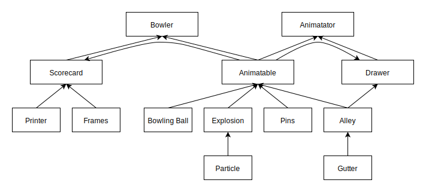

# Bowling

### Play: http://ricky.hewitt.tech/bowling

### What is this project to me?

This project was a play with HTML canvas.
I'm proud of the encapsulation that I achieved here.
Coordinating thirteen classes in a single page app is a personal first.

### The Domain Model

#### Bowler:

- contains the event listeners to create a bowling ball.
- connects the animation to the scorecard.

##### Animator:

- updates and clears the canvas.
- requests animation frame and passes delta-time as a parameter.

##### Animatable:

- stores all animatable objects.
- handles interactions e.g. collisions/explosions.
- updates objects by delta-time.

##### Drawer:

- specifically draws animatable objects.

#### Bowling Ball:

- A circle that moves on a trajectory between two points.

#### Explosion:

- A collection of particles.

#### Particle:

- A small circle that moves on a random trajectory.

#### Pins:

- An array of point locations.
- Has a ricochet effect.

#### Alley:

- The dimensions of the bowling alley.

#### Gutter:

- An x(y) line that defines the edge of the Alley.

#### Scorecard:

- Receives scores for the bowler.
- Contains a collection of score frames.

#### Printer:

- Totals frames.
- Outputs frames into HTML.
